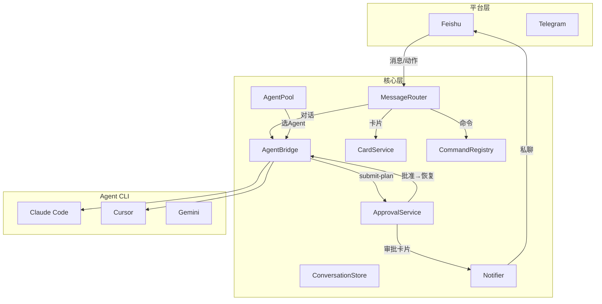
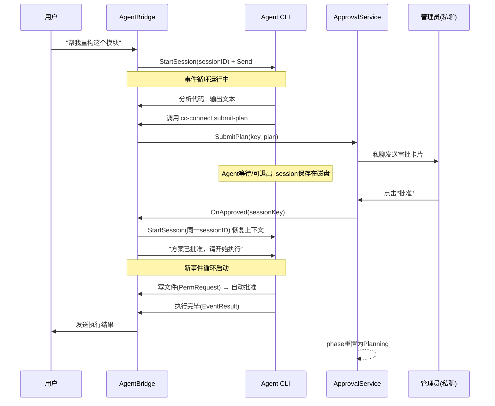
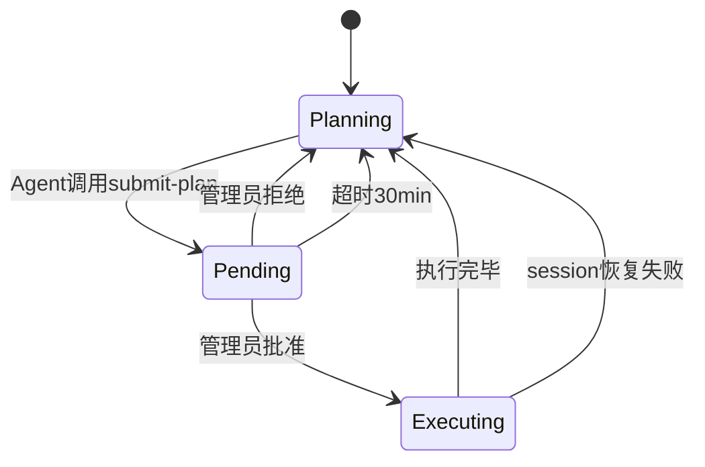

# cc-connect 整体架构重设计

## 核心问题

1. **Engine 上帝对象** — 40+ 字段、150+ 方法
2. **会话状态散落** — Session / interactiveState / ApprovalState 三个独立 map
3. **审批流程断裂** — 审批时事件循环退出，批准后 Agent 输出全部丢失
4. **审批粒度错误** — 当前是 per-tool 拦截，用户要的是方案级一次性审批
5. **Agent 固定** — 不能运行时切换 CLI
6. **命令全英文** — 用户记不住

## 目标架构




## 1. 统一会话模型 — ConversationContext

合并 Session + interactiveState + ApprovalState 为一个结构体：

```go
type ConversationContext struct {
    mu sync.Mutex
    Key            string         // "feishu:chatID:userID"
    Platform       string
    OwnerID        string
    AgentName      string         // "claude" / "cursor"
    AgentSessionID string         // 持久化
    History        []HistoryEntry // 持久化
    Name           string         // 持久化
    AgentSession   AgentSession   // 运行时
    ReplyPlatform  Platform       // 运行时
    ReplyCtx       any            // 运行时
    Busy           bool
    Quiet          bool
    ApprovalPhase  ApprovalPhase  // Planning/Pending/Executing
    PlanText       string
    ReviewerID     string
    DeleteMode     *DeleteModeState
    PendingPerm    *PendingPermission
}
```

一个 key、一把锁、一个生命周期。

## 2. 方案级审批 — ApprovalService

**核心原则：审批的是方案，不是单个工具调用。一次审批，整体执行。**

### 完整流程




### 关键设计

```go
type ApprovalService struct {
    conversations *ConversationStore
    notifier      *Notifier
    bridge        *AgentBridge
    stateFile     string        // 持久化，重启恢复
    timeout       time.Duration // 30min
}

func (a *ApprovalService) SubmitPlan(key, userMsg, plan string) error
func (a *ApprovalService) Approve(key, reviewer string) error   // → bridge.ResumeSession
func (a *ApprovalService) Reject(key, reviewer, reason string) error
func (a *ApprovalService) CheckTimeouts()
```

状态机：




### 与当前实现的核心区别

- **触发**：Agent 主动 `submit-plan`，不是工具拦截自动触发
- **粒度**：方案级一次性审批，不是 per-tool
- **Plan 阶段写操作**：deny + 告诉 Agent "请先 submit-plan"，不触发审批
- **批准后**：恢复 session + 启动新事件循环（不再丢失输出）
- **Agent 进程**：可退出，批准后用 sessionID 恢复（混合模式）
- **持久化**：审批状态写文件，重启不丢
- **超时**：30 分钟无响应自动重置

## 3. AgentPool — 运行时切换

```go
type AgentPool struct {
    agents  map[string]Agent  // "claude"→Agent, "cursor"→Agent
    active  string
    perUser map[string]string
}
```

`/agent cursor` 或 `/引擎 cursor` 切换。清空 AgentSessionID，下次消息用新 Agent。

## 4. 中文命令 + 菜单驱动

中文别名内置到 builtinCommands：

- `/帮助` `/新建` `/列表` `/切换` `/模型` `/引擎` `/停止` `/批准` `/拒绝` `/状态`

菜单驱动：`/帮助` 弹出卡片，底部快捷按钮 [新建] [切换] [模型] [引擎] [更多]。

## 5. CardService 注册表

```go
type CardService struct {
    navHandlers map[string]ActionHandler
    actHandlers map[string]ActionHandler
}
```

替代 30+ 分支 switch/case，新功能只需注册 handler。

## 6. 平台解耦

平台只做：收消息→Router、收动作→CardService、发消息→Sender 接口。所有业务逻辑在 core。

## 7. Session Key 类型化

```go
type SessionKey struct {
    Platform string
    ChatID   string
    UserID   string
}
func (k SessionKey) String() string
func (k SessionKey) PrivateKey() string
func ParseSessionKey(s string) SessionKey
```

## 实施步骤

### Phase 1: 统一会话模型

1. 创建 ConversationContext 和 ConversationStore
2. Engine 内部用 ConversationStore 替代三个 map
3. 迁移所有读写点
4. 测试通过

### Phase 2: 方案级审批

1. 重写 ApprovalService（submit-plan 触发，批准后恢复 session）
2. AgentBridge.ResumeSession — 批准后恢复 session 并启动事件循环
3. 删除 isWriteTool 自动拦截逻辑
4. 审批状态持久化 + 超时机制

### Phase 2b: Agent 切换

1. 创建 AgentPool，config.toml 支持多 agent
2. /agent 命令 + 选择卡片

### Phase 2c: 中文命令 + 菜单

1. builtinCommands 加中文别名
2. 快捷操作卡片模板

### Phase 3: 平台解耦

1. CardService 注册表替代 switch/case
2. 飞书 onCardAction 业务逻辑上移到 core
3. Session Key 类型化

### Phase 4: 清理

1. Engine → App
2. 更新测试
3. 文档

